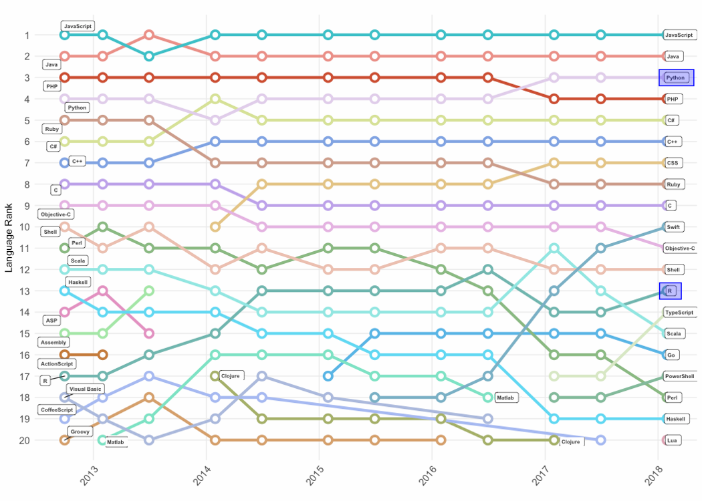

```{r load_packages, message=FALSE, warning=FALSE, include=FALSE} 
library(fontawesome)
```
    
<aside class="notes">
I'm Andrew Collier and I'll be talking about mixed language programming with R and Python.

As you can see I come from South Africa and I work as a Freelance Data Scientist for Toptal. Toptal is an exclusive talent network for technical specialists. Leading companies rely on Toptal freelancers for their most important projects.

These are some of the topics and tools that I'll be talking about. Feel free to use these liberally if you are active on Twitter.
</aside>

<div class="align-center" style="font-size: 200%;">
  <code class="hashtag">#python #rstats</code>
  <code class="hashtag">#rpy2 #reticulate</code>
  <code class="handle">@projectjupyter</code>
  <code class="handle">@rstudio</code><br>
  <code class="handle">@brunolucian</code>
</div>

# {data-background-image="img/pythonvsR.png"}


---

<div>

<p class="caption">Rankings das linguagem de programação (Redmonk, Q1 2018).</p>
</div>

---

<div>
  
  <p class="caption">Evolução ao longo do tempo. (Redmonk, Q1 2018).</p>
</div>

---


## `r fa("r-project", fill = "steelblue", height = 0)` 

#### R
- Primeira release em 1995

#### Pontos Fortes
- Muitas opçoes de pacotes no [CRAN](https://cran.r-project.org/)
- Muitos conjuntos de dados disponíveis
- Grande opções de distribuições estatisticas
- Excelente documentação

#### Pontos Fracos

- pode ser lento e consumir muita memória
- curva de aprendizado pode ser desafiadora.

---

### Python 
<i class="fab fa-python fa-2x"></i>

- Primeira release em 1991
- primeira release do, scikit-learn em 2007 e do pandas em 2008.

#### Pontos fortes

- explicitamente orientada a objetos
- incentiva código estruturado
- uso geral e
- simples para colocar algoritmos em produção.

#### Pontos fracos

- não é nativa para os problemas de Data Science
- dependencia de modulos pode ser um desafio.


---

Como podemos<br>
<span class="emphasis">aproveitar</span><br>
o <br>
<span class="emphasis">melhor</span><br>
dos<br>
<span class="emphasis">dois</span><br>
mundos?

---


Não pensamos duas vezes antes de misturar um pouco de SQL com a linguagem que estamos usando.

```{r eval=FALSE}
# R
#
dbGetQuery(db, "SELECT * FROM customer;")
```

```{r eval=FALSE}
# Python
#
db.execute("SELECT * FROM customer;")
```

<aside class="notes">
There should be no objection to embedding some SQL in a string within your Python (or R) script.
</aside>

---

<div>
  
</div>


# Python com R 

<div class="align-center">
  
</div>


## Opções para uso do Python com R

- [PypeR](http://bioinfo.ihb.ac.cn/softwares/PypeR/)
    * release 1.1.2 (2014)
- [pyRserve](https://pypi.org/project/pyRserve/)
    * uses [Rserve](http://www.rforge.net/Rserve/)
    * release 0.9.1 (2017)
- [rpy2](https://rpy2.bitbucket.io/)
    * roda o R incorporado em um processo Python
    * release 2.9.4 (2018)

<aside class="notes">
O desenvolvimento do PypeR parece ter parado, sendo o mais recente lançamento em 2014.
</aside>

---

<div class="align-center">


https://rpy2.bitbucket.io/
</div>

- Instalação via `pip`.

```{bash eval=FALSE}
pip install rpy2
```

## {data-background-image="img/demo-time-getting-serious2.png"}

# `r fa("r-project", fill = "steelblue")` feat. <i class="fab fa-python fa-2x"></i>


## Opções para uso do R com Python

- [rJython](https://r-forge.r-project.org/projects/rjython/)
    * release 0.0-4 (2012)
- [rPython](http://rpython.r-forge.r-project.org/)
    * release 	0.0-6 (2015)
- [SnakeCharmR](https://github.com/asieira/SnakeCharmR)
    * release 	1.0.7 (2017)
- [PythonInR](https://bitbucket.org/Floooo/pythoninr/)
    * release 0.1-4 (2018)
- [reticulate](https://github.com/rstudio/reticulate)
    * roda o Python incorporado em um processo R
    * release 1.8 (2018)

---

<div class="align-center">
{width=300px}

https://github.com/rstudio/reticulate
</div>

- Instalação pelo CRAN ou GitHub.

```{r eval=FALSE}
# - CRAN
install.packages("reticulate")
# - GitHub
devtools::install_github("rstudio/reticulate")
```

## {data-background-image="img/demo-time-getting-serious2.png"}

# <i class="fab fa-python fa-2x"></i> $+$ <i class="fab fa-r-project fa-2x"></i>

---

<div class="container">
<div class="col">
### rpy2

- Roda código R
- Jupyter magic: `%R`(inline) e `%%R`(bloco)
- `-i` e `-o` para bloco
- `pandas2ri` conversão
</div>
<div class="col">
### reticulate

- roda código python
- ambiente virtuais
- `import()` módulos
- `repl_python()`
- `py$` e `r.` para navegar entre os objetos
</div>
</div>

---

Claramente</br><span class="emphasis">ambas</span><br>linguagem são<br><span class="emphasis">importantes</span>.

---

Um Cientista de dados deveria pelo menos<br><span class="emphasis">compreender</span><br>as<br><span class="emphasis">duas.</span>

---

Nós podemos <br> <span class = "emphasis"> dividir </span> nosso amor entre <span class = "emphasis"> ambas </span> <br> linguagens!

---


<div class="container">
<div class="col">
Devemos trabalhar<br><span class="emphasis">juntos</span><br>e<br><span class="emphasis">Shallow Now.</span>
</div>
</div>


